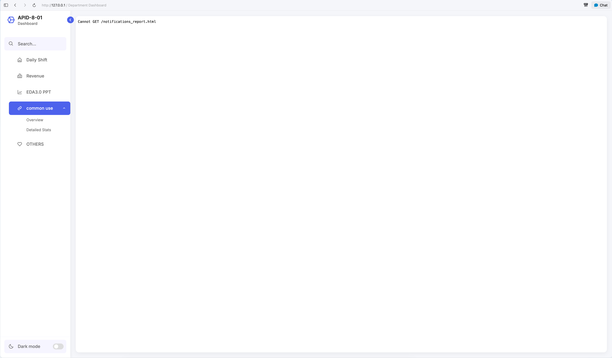

# 📊 APID-8-01 Department Dashboard

A premium, highly responsive, and modern department dashboard shell designed for displaying various operations reports seamlessly. Built using HTML5, CSS3, JavaScript, Bootstrap 5, and Boxicons.

---

## 📸 Showcase

Here is a preview of the APID-8-01 Department Dashboard:



---

## ✨ Features

- **Responsive Sidebar:** Collapsible navigation drawer featuring perfect alignment, auto-hiding navigation text, and optimized active state indicators.
- **Interactive Multi-Level Menus:** Supports nested sub-menus with smooth vertical expanding transitions and localized non-inheriting active backgrounds.
- **Light / Dark Mode Toggle:** Native toggling with micro-animations that adjusts the entire dashboard to high-contrast dark colors seamlessly.
- **Isolated Sandbox Viewport:** Employs a centered, responsive iframe window to load different department reports (`dashboard_report.html`, `revenue_report.html`, etc.) dynamically without page reloads.

---

## 📁 File Structure

```text
WEB/
├── index.html              # Main dashboard layout and sidebar shell
├── home.html               # Default content loaded into the iframe
├── dashboard_report.html   # Sample report page
├── revenue_report.html     # Sample report page
├── style.css               # Core styling, responsive transitions, & layout overrides
├── script.js               # Sidebar toggle, submenu controller, & dark mode logic
├── bootstrap5.css          # Local Bootstrap 5 styles
├── boxicon.css             # Local Boxicons styles
├── bundle.js               # Local JS dependencies
├── README.md               # Documentation and project overview
├── IMG/                    # Image assets directory
├── Announce_img/           # Announcement images directory
└── Tools/                  # Additional tools directory
```

---

## 🚀 Getting Started

Simply open `index.html` directly in your preferred web browser to view the application:

```bash
# To open on macOS
open index.html

# Or serve locally using npm/http-server
npx http-server .
```

---

## 🛠️ Technology Stack

- **HTML5 & CSS3** (Vanilla Flexbox & Grid architectures)
- **Vanilla JavaScript** (ES6 components)
- **Bootstrap v5** (Grid foundation)
- **Boxicons** (Material icon typography)

---

## 🏗️ How to Utilize This Template

This template is designed to be easily customized for any department dashboard. Here is how you can modify it to suit your needs:

### 1. Where to Modify Links

All sidebar navigation links are located in `index.html` within the `<ul class="menu-links">` section (around line 38). Find the `<a>` tags inside the `<li>` items to update the `href` attribute with the path to your new report or page.

### 2. Opening in New Tab vs. Content Frame

- **Embed in Content Frame (Default):** To open a page inside the dashboard without reloading the entire application, set the `target` attribute to `content-frame`:
  ```html
  <a href="your_report.html" target="content-frame">Report Name</a>
  ```
- **Open in New Tab:** If you want a link to open in a completely new browser tab outside of the dashboard, change the `target` attribute to `_blank`:
  ```html
  <a href="your_report.html" target="_blank">Report Name</a>
  ```

### 3. How to Add a New Menu/Submenu

To add a new main menu item with a submenu, copy and paste the following block into the `<ul class="menu-links">` in `index.html`:

```html
<li class="nav-link sub-menu-wrap">
    <a href="#" class="submenu-toggle">
        <i class='bx bx-folder icon'></i> <!-- Change Icon -->
        <span class="text nav-text">New Menu</span> <!-- Menu Title -->
        <i class='bx bx-chevron-down arrow text'></i>
    </a>
    <ul class="sub-menu">
        <li><a href="new_page_1.html" target="content-frame">Submenu 1</a></li>git
        <li><a href="new_page_2.html" target="content-frame">Submenu 2</a></li>
    </ul>
</li>
```

*Tip: Change the `bx-folder` class to any other icon from [Boxicons](https://boxicons.com/).*

### 4. How to Modify the Home Page

The default page loaded when the dashboard opens is `home.html`.

- To edit its content, simply open `home.html` and make your changes. It will automatically be reflected in the main iframe view of the dashboard.
- If you want to change which file is loaded by default, edit the `src` attribute of the `iframe` in `index.html` (around line 114):
  ```html
  <iframe name="content-frame" src="your_new_home.html" frameborder="0" class="content-iframe"></iframe>
  ```
