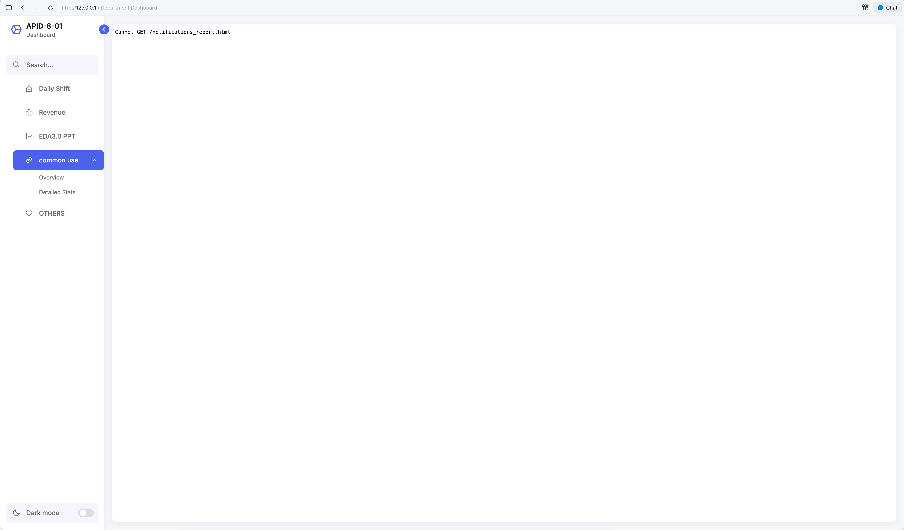

# 📊 APID-8-01 Department Dashboard

A premium, highly responsive, and modern department dashboard shell designed for displaying various operations reports seamlessly. Built using HTML5, CSS3, JavaScript, Bootstrap 5, and Boxicons.

---

## 📸 Showcase

Here is a preview of the APID-8-01 Department Dashboard:



---

## ✨ Features

- **Responsive Sidebar:** Collapsible navigation drawer featuring perfect alignment, auto-hiding navigation text, and optimized active state indicators.
- **Interactive Multi-Level Menus:** Supports nested sub-menus with smooth vertical expanding transitions and localized non-inheriting active backgrounds.
- **Light / Dark Mode Toggle:** Native toggling with micro-animations that adjusts the entire dashboard to high-contrast dark colors seamlessly.
- **Isolated Sandbox Viewport:** Employs a centered, responsive iframe window to load different department reports (`dashboard_report.html`, `revenue_report.html`, etc.) dynamically without page reloads.

---

## 📁 File Structure

```text
WEB/
├── index.html              # Main dashboard layout and sidebar shell
├── home.html               # Default content loaded into the iframe
├── dashboard_report.html   # Sample report page
├── revenue_report.html     # Sample report page
├── style.css               # Core styling, responsive transitions, & layout overrides
├── script.js               # Sidebar toggle, submenu controller, & dark mode logic
├── bootstrap5.css          # Local Bootstrap 5 styles
├── boxicon.css             # Local Boxicons styles
├── bundle.js               # Local JS dependencies
├── assets/                 # Offline enhancements for published Excel tables
├── reports/                # One published Excel Web Page per report folder
├── Update-InteractiveReports.cmd # Applies table controls after Excel publishes HTML
├── README.md               # Documentation and project overview
├── IMG/                    # Image assets directory
├── Announce_img/           # Announcement images directory
└── Tools/                  # Additional tools directory
```

---

## 🚀 Getting Started

Simply open `index.html` directly in your preferred web browser to view the application:

```bash
# To open on macOS
open index.html

# Or serve locally using npm/http-server
npx http-server .
```

---

## 🛠️ Technology Stack

- **HTML5 & CSS3** (Vanilla Flexbox & Grid architectures)
- **Vanilla JavaScript** (ES6 components)
- **Bootstrap v5** (Grid foundation)
- **Boxicons** (Material icon typography)

---

## 🏗️ How to Utilize This Template

This template is designed to be easily customized for any department dashboard. Here is how you can modify it to suit your needs:

### 1. Where to Modify Links

All sidebar navigation links are located in `index.html` within the `<ul class="menu-links">` section (around line 38). Find the `<a>` tags inside the `<li>` items to update the `href` attribute with the path to your new report or page.

### 2. Opening in New Tab vs. Content Frame

- **Embed in Content Frame (Default):** To open a page inside the dashboard without reloading the entire application, set the `target` attribute to `content-frame`:
  ```html
  <a href="your_report.html" target="content-frame">Report Name</a>
  ```
- **Open in New Tab:** If you want a link to open in a completely new browser tab outside of the dashboard, change the `target` attribute to `_blank`:
  ```html
  <a href="your_report.html" target="_blank">Report Name</a>
  ```

### 3. How to Add a New Menu/Submenu

To add a new main menu item with a submenu, copy and paste the following block into the `<ul class="menu-links">` in `index.html`:

```html
<li class="nav-link sub-menu-wrap">
    <a href="#" class="submenu-toggle">
        <i class='bx bx-folder icon'></i> <!-- Change Icon -->
        <span class="text nav-text">New Menu</span> <!-- Menu Title -->
        <i class='bx bx-chevron-down arrow text'></i>
    </a>
    <ul class="sub-menu">
        <li><a href="new_page_1.html" target="content-frame">Submenu 1</a></li>git
        <li><a href="new_page_2.html" target="content-frame">Submenu 2</a></li>
    </ul>
</li>
```

*Tip: Change the `bx-folder` class to any other icon from [Boxicons](https://boxicons.com/).*

### 4. How to Modify the Home Page

The default page loaded when the dashboard opens is `home.html`.

- To edit its content, simply open `home.html` and make your changes. It will automatically be reflected in the main iframe view of the dashboard.
- If you want to change which file is loaded by default, edit the `src` attribute of the `iframe` in `index.html` (around line 114):
  ```html
  <iframe name="content-frame" src="your_new_home.html" frameborder="0" class="content-iframe"></iframe>
  ```

### 5. Published Excel HTML reports

Publish each Excel report as a Web Page inside its own `reports/<report-name>/` folder. Then double-click `Update-InteractiveReports.cmd`. It updates the generated worksheet HTML files with local-only controls for search, filtering, sorting, column visibility, resizing, and copying selected cells. It never opens or alters the original Excel workbook.

Finally, add one sidebar link per report, using a relative path to its main HTML file:

```html
<li><a href="reports/bill/bill.html" target="content-frame">Bill</a></li>
```

## Excel-to-HTML interactive report SOP

Use this process whenever a new Excel report needs to appear in the dashboard. The report stays a local, read-only HTML display: filtering, sorting, and copying do **not** change the Excel workbook.

### 1. Publish the workbook into its own report folder

In Excel, use **Save As / Publish as Web Page** and publish each report to this layout:

```text
WEB/
  reports/
    bill/
      bill.html
      bill.fld/
        sheet001.html
        stylesheet.css
    inventory/
      inventory.html
      inventory.fld/
        sheet001.html
```

Keep one report per folder. The main `<report>.html` is the page the dashboard loads; the `.fld/sheet001.html` file contains the actual Excel table.

### 2. Add the report to the sidebar

In `index.html`, add a separate link for every report. Always use a **relative** path and keep `target="content-frame"` so it appears inside the dashboard:

```html
<li><a href="reports/bill/bill.html" target="content-frame">Bill</a></li>
<li><a href="reports/inventory/inventory.html" target="content-frame">Inventory</a></li>
```

Do not use `C:\...`, a drive letter, or `file:///...` in these links. The relative path keeps the dashboard working when the shared drive is mounted under a different drive letter.

### 3. Apply the interactive table tools on Windows

After every Excel publish, double-click `Update-InteractiveReports.cmd` in the `WEB` root folder. It runs `Tools/Enhance-ExcelHtmlReports.ps1` and automatically updates every worksheet HTML file under `reports/`.

The tool is safe to run repeatedly. It replaces its prior injected references instead of adding duplicates. It only changes the generated HTML files; it never opens, saves, or modifies the `.xlsx` / `.xlsm` file.

### 4. Confirm the result

Open `index.html` in Chrome, select the report from the sidebar, and confirm that the table includes:

- Search all columns
- Per-column filters and sortable headings
- Columns visibility menu and drag-to-resize headings
- Drag to select cells, then press `Ctrl+C` (or `Cmd+C` on macOS) to copy

### Recovery path: the Windows shortcut cannot run

If `Update-InteractiveReports.cmd` is blocked, missing, or points to the wrong folder, the report can still be enabled manually. Open the real worksheet file, normally `reports/<report-name>/<report-name>.fld/sheet001.html`, and insert these two lines immediately before `</head>`:

```html
<link rel="stylesheet" href="../../../assets/excel-table-tools.css" data-excel-table-tools>
<script src="../../../assets/excel-table-tools.js" defer data-excel-table-tools></script>
```

The path above is correct for the standard `reports/<report-name>/<report-name>.fld/sheet001.html` layout. Save the file, reload the dashboard in Chrome, and click the sidebar item again.

For an older report stored directly in the `WEB` root, such as `WEB/bill.fld/sheet001.html`, use one fewer level:

```html
<link rel="stylesheet" href="../assets/excel-table-tools.css" data-excel-table-tools>
<script src="../assets/excel-table-tools.js" defer data-excel-table-tools></script>
```

Excel will overwrite these two lines when it publishes the report again. Re-run the Windows shortcut after each publish, or repeat the manual insertion if the shortcut remains unavailable.

### Troubleshooting checklist

- **The sidebar opens a blank page:** check that the `href` points to the report's main `.html` file, not to `sheet001.html`.
- **The report loads but has no controls:** open the matching `.fld/sheet001.html` and verify the two `data-excel-table-tools` lines are present before `</head>`.
- **Styles or controls fail to load:** check the relative `../assets/` or `../../../assets/` path against the table above; the path is relative to `sheet001.html`, not `index.html`.
- **Excel overwrote the controls:** this is expected after publishing; run `Update-InteractiveReports.cmd` again.
- **A table is not enhanced:** the report must contain an HTML `<table>` with at least a header row and one data row. The tool enhances the largest table in that worksheet.
